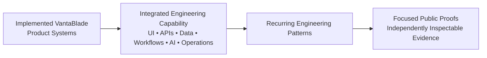
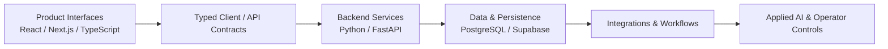
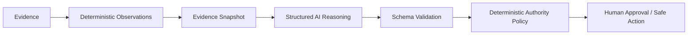
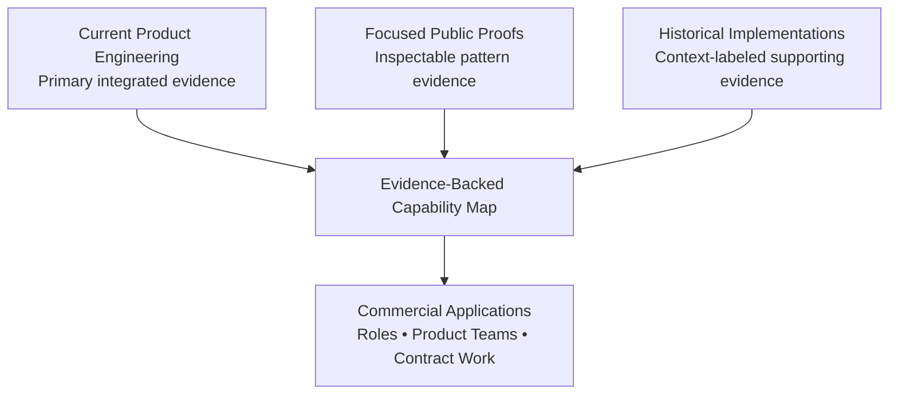

# McCallum Clarke — Engineering Portfolio

## Full-Stack & Applied AI Engineer

Product Systems • APIs • Data Pipelines • Integrations • Intelligent Automation

I engineer complete product systems across frontend interfaces, typed contracts, backend services, persistence, external integrations, workflow state, automation, applied AI, reporting, and operator tooling.

The strongest evidence in this portfolio is the implemented VantaBlade product environment: customer-facing and internal systems in which those capabilities operate together. The four public repositories below play a different role. They isolate recurring engineering patterns from that broader work so reliability, AI-control, integration, and automation decisions can be inspected independently.

My strongest technical differentiation is end-to-end product ownership, with particular depth in backend/API engineering, data and workflow reliability, external integrations, intelligent automation, controlled applied AI, and operational tooling.

---

## Engineering overview

I work across a system's complete delivery boundary:

- React, Next.js, and TypeScript product interfaces
- typed client/API contracts and explicit loading, error, retry, and recovery states
- Python/FastAPI services and authenticated REST APIs
- PostgreSQL/Supabase data models, migrations, authorization, and storage
- provider integrations, webhooks, scheduled work, and background processing
- deterministic rules combined with bounded, evidence-aware AI behavior
- reporting, analytics, approval flows, and internal operational controls

VantaBlade builds security products, but the engineering capability demonstrated by those products is broader than the security domain. The same system patterns apply to SaaS products, assessment and reporting tools, data-enrichment workflows, paid digital products, internal operations platforms, and AI-assisted decision systems.

---

## Flagship product systems

### [VantaBlade Identity Risk Ops](product-systems/vantablade-identity-risk-ops.md)

An authenticated multi-tenant SaaS product that turns employee identity-exposure data into operational incidents, identity cases, remediation workflows, reporting, and ongoing organizational workflow state.

It is the strongest integrated example in this portfolio: a Next.js/React/TypeScript customer application connected through typed contracts to Python/FastAPI services, Supabase Auth, PostgreSQL Row Level Security, tenant-scoped persistence, background scan workflows, entitlement and trial logic, first-party analytics, and operator tooling.

The operational flow is:

```text
Employee inventory
  → exposure scan
  → normalized findings
  → net-new exposure detection
  → incidents
  → identity cases
  → remediation state
  → reporting
```

The system includes company and membership state; employee onboarding, activation, deactivation, and backend-enforced limits; queued and running scan lifecycle state; incident/case closure behavior; operational and executive reports; and acquisition-through-activation funnel instrumentation.

### [VantaBlade DeepScan](product-systems/deepscan.md)

A multi-source identity-intelligence and applied-AI workflow that transforms heterogeneous exposure data into structured risk analysis, remediation guidance, persisted reports, and customer delivery.

DeepScan orchestrates Have I Been Pwned and DeHashed behind provider-specific boundaries, normalizes multiple identifier types, deduplicates and fuses findings, and preserves explicit partial/degraded states around provider failure. Deterministic code owns important scoring, evidence, and remediation decisions; OpenAI-assisted analysis and narrative paths are used within those boundaries rather than being treated as unrestricted authority.

The surrounding paid workflow includes verified Gumroad intake, purchase persistence, expiring tokenized links, one-time consumption state, background execution, report/PDF generation, Supabase-backed persistence and storage, and email delivery.

### [VantaBlade FreeScan](product-systems/freescan.md)

A lightweight public data product that turns an anonymous user action into external-data retrieval, normalized risk results, generated reporting, delivery, and downstream product-funnel events.

FreeScan connects a public Next.js experience to a FastAPI endpoint and HIBP integration, translates provider data into a stable result contract, renders product states, generates and stores PDF reports, supports email delivery, and feeds the FreeScan-to-DeepScan commercial path and first-party analytics system.

This portfolio makes no blanket claim that FreeScan identifiers or results are processed only in memory. The current backend includes persistence for scan, funnel, and report workflows; privacy-sensitive boundaries are therefore described conservatively.

[Browse all product-system case studies →](product-systems/README.md)

---

## Product systems → engineering patterns → public proofs

Complete product systems demonstrate integration and ownership. Focused public proofs make selected patterns reproducible and easy to inspect in isolation.



| Product system | Major engineering areas | Related focused proofs |
| --- | --- | --- |
| Identity Risk Ops | Authenticated SaaS, multi-tenancy, authorization, workflow state, background operations, reporting, analytics | [Data Intake](https://github.com/vantablade-ai/reliable-data-intake-pipeline), [Webhook Workflow](https://github.com/vantablade-ai/reliable-webhook-workflow), [Controlled AI](https://github.com/vantablade-ai/controlled-ai-decision-pipeline) |
| DeepScan | Provider integrations, normalization, deterministic and AI-assisted analysis, commerce intake, async workflow, reporting | [Data Intake](https://github.com/vantablade-ai/reliable-data-intake-pipeline), [Controlled AI](https://github.com/vantablade-ai/controlled-ai-decision-pipeline), [Webhook Workflow](https://github.com/vantablade-ai/reliable-webhook-workflow) |
| FreeScan | Public API integration, external-data transformation, report delivery, funnel workflow | [Data Intake](https://github.com/vantablade-ai/reliable-data-intake-pipeline), [Webhook Workflow](https://github.com/vantablade-ai/reliable-webhook-workflow) |

These relationships indicate shared engineering patterns, not code identity or a claim that a focused repository reproduces an entire product.

---

## End-to-end product engineering

I work across the full product boundary rather than treating frontend, backend, data, integrations, and AI as disconnected disciplines.



Identity Risk Ops makes that ownership concrete. Customer and operator interfaces render backend-authoritative tenant, entitlement, scan, incident, case, report, and analytics state. Typed API clients connect those interfaces to authenticated services. The services enforce access and workflow rules, coordinate providers and background execution, persist state, and expose explicit operational outcomes.

DeepScan and FreeScan demonstrate the same ownership at different product scales: intake and validation, external-data retrieval, transformation, decision logic, persistence, report generation, delivery, and funnel transitions remain connected as one system.

---

## Engineering thesis

### Reliability around uncertain boundaries

A recurring engineering problem across my work is making systems reliable where uncertainty enters.

External data may be malformed, incomplete, duplicated, or inconsistent. Third-party APIs can fail, retry, rate-limit, or return unexpected state. Asynchronous work can repeat, stall, or terminate mid-execution. AI outputs are probabilistic and should not automatically own authority. Long-running workflows need provenance, resumability, explicit failure state, and controlled recovery.

I respond with:

- explicit, typed contracts at system boundaries
- canonical normalization before downstream decisions
- deterministic rules where deterministic rules are sufficient
- idempotency, fingerprints, and duplicate/conflict semantics
- provenance and evidence-quality signals
- explicit lifecycle and failure state
- retry, recovery, and dead-letter paths where appropriate
- bounded model authority and schema validation
- human approval for consequential actions
- integrity checks before cached data or generated artifacts are reused

The engineering goal is not to pretend uncertainty has disappeared. It is to make uncertainty visible, bounded, and operationally manageable.

---

## Focused public engineering proofs

The following repositories are focused, independently inspectable implementations of recurring engineering patterns used across broader product engineering work. They provide reproducible evidence of specific reliability, AI-control, integration, and workflow behaviors without attempting to reproduce the entire VantaBlade product environment.

They are an important evidence layer, but they are not the limit or primary definition of my capability.

### 1. [Reliable Data Intake Pipeline](https://github.com/vantablade-ai/reliable-data-intake-pipeline)

A reliability-focused ingestion service that validates, normalizes, conservatively deduplicates, and routes heterogeneous provider data into canonical application records.

Provider-specific adapters feed typed models and deterministic decision logic, with idempotency semantics, transactional persistence, provenance, conflict handling, and observable failure states.

**Demonstrates**

- FastAPI API boundaries and Pydantic validation
- provider adapters and typed canonical models
- normalization and canonicalization
- conservative deduplication and deterministic record fingerprints
- idempotent request handling
- source and entity conflict detection
- `ACCEPTED` / `REVIEW_REQUIRED` / `REJECTED` routing
- transactional SQLite persistence
- provenance, controlled API errors, and deterministic failure-path tests

**Boundary:** The proof uses synthetic providers and local SQLite persistence so its data-reliability behavior is reproducible. It does not claim production-scale throughput or replace the separate PostgreSQL/Supabase product evidence.

**Commercial relevance:** Provider integrations, ingestion APIs, enrichment and ETL-style workflows, canonical data modeling, deduplication, review queues, and unreliable external-data handling.

### 2. [Controlled AI Decision Pipeline](https://github.com/vantablade-ai/controlled-ai-decision-pipeline)

An applied-AI system that turns evidence into structured AI-assisted decisions while keeping final authority in deterministic policy and human review.



**Demonstrates**

- typed AI boundaries and schema-constrained outputs
- canonical evidence snapshots and provenance hashes
- evidence quality, conflicts, limitations, and confidence modeling
- deterministic policy around probabilistic reasoning
- bounded model authority and safe-action allowlists
- human approval gates and audit persistence
- provider abstraction and optional OpenAI integration
- deterministic offline execution
- safe handling of invalid provider output and insufficient evidence

**Boundary:** The model can reason and recommend, but it cannot grant itself operational authority. High confidence cannot compensate for poor evidence, and weak or conflicting evidence cannot silently become an automated action.

**Commercial relevance:** AI product features, operator copilots, decision-support systems, controlled automation, review workflows, and human-in-the-loop applications.

### 3. [Reliable Webhook Workflow](https://github.com/vantablade-ai/reliable-webhook-workflow)

A durable webhook-processing system that accepts external events quickly and processes them through retryable background execution.


**Demonstrates**

- FastAPI webhook boundaries
- raw-body HMAC-SHA256 verification and constant-time comparison
- duplicate-safe event intake, provider identity, and payload fingerprinting
- duplicate/conflict semantics and transactional event/job creation
- atomic worker claims and execution history
- retryable versus terminal failure classification
- exponential backoff, jitter, and worker leases
- stale-worker recovery and dead-letter handling
- deterministic clock/jitter testing
- recoverable at-least-once execution

**Boundary:** The proof does not claim distributed exactly-once side effects. If a worker dies after an external side effect succeeds but before local completion is committed, the operation may be attempted again; downstream idempotency is still required where that boundary matters.

**Commercial relevance:** SaaS integrations, payment/event processing, webhook consumers, background workers, retryable API jobs, integration hardening, and failure recovery.

### 4. [Signal-to-Content Automation Pipeline](https://github.com/vantablade-ai/signal-to-content-automation-pipeline)

A resumable multi-stage automation pipeline that transforms heterogeneous source material into structured, traceable artifacts.

Source adapters, normalization, filtering, deduplication, AI-assisted stages, deterministic ranking, media generation, and packaging are coordinated through explicit dependencies and cache-aware execution.

**Demonstrates**

- source adapters, canonical normalization, and deterministic filtering
- exact-reference and content deduplication
- structured AI-assisted classification and deterministic weighted ranking
- typed brief and script artifacts
- explicit stage dependency graphs and stage fingerprints
- SHA-256 artifact provenance and integrity verification
- cache validation and dependency-aware invalidation
- resumability, failure isolation, and stale-descendant invalidation
- deterministic synthetic WAV and SRT generation
- optional FFmpeg media rendering and local artifact packaging
- deterministic offline execution

**Boundary:** Publishing, uploading, and social-media posting are intentionally outside this proof. It demonstrates reliable artifact production, lineage, selective recomputation, failure isolation, and safe resumption—not production social publishing.

**Commercial relevance:** Research pipelines, document and report generation, media processing, batch automation, AI-assisted operations, and resumable artifact-producing workflows.

---

## Public proof capability matrix

“✓” means the behavior is directly demonstrated in that repository.

| Capability | Data Intake | AI Decision | Webhook Workflow | Automation Pipeline |
| --- | --- | --- | --- | --- |
| Typed contracts | ✓ | ✓ | ✓ | ✓ |
| API boundary | ✓ | ✓ | ✓ | — |
| Adapter/provider abstraction | ✓ | ✓ | ✓ | ✓ |
| Canonical normalization | ✓ | — | — | ✓ |
| Duplicate/idempotency handling | ✓ | — | ✓ | ✓ |
| Explicit conflict/failure handling | ✓ | ✓ | ✓ | ✓ |
| Provenance / auditability | ✓ | ✓ | ✓ | ✓ |
| Structured AI output | — | ✓ | — | ✓ |
| Deterministic policy | ✓ | ✓ | ✓ | ✓ |
| Human approval boundary | — | ✓ | — | — |
| Background execution | — | — | ✓ | — |
| Retry / recovery | — | — | ✓ | ✓ |
| Artifact or payload hashing | ✓ | ✓ | ✓ | ✓ |
| Dependency-aware caching | — | — | — | ✓ |
| Resumability | — | — | ✓ | ✓ |
| Integrity verification | ✓ | ✓ | ✓ | ✓ |
| Offline deterministic testing | ✓ | ✓ | ✓ | ✓ |
| Media processing | — | — | — | ✓ |

---

## Broader engineering capability

### Full-stack product systems

- end-to-end product/system ownership
- React, Next.js, and TypeScript application engineering
- authenticated SaaS applications and customer workspaces
- operator tooling and complex, stateful workflow interfaces
- typed frontend/backend integration
- component, URL, session, and persistence-oriented frontend state
- async/loading/error/retry/recovery UX
- review, approval, and human-in-the-loop AI interfaces
- first-party product analytics instrumentation
- responsive implementation and accessibility fundamentals
- design-system implementation across public and authenticated product surfaces

Frontend engineering is core to my full-stack product work. I do not use that evidence to claim separate specialization in browser internals, advanced rendering/performance work, or large-scale frontend platform engineering.

### Backend & APIs

- Python, FastAPI, REST, and Pydantic
- modular route, service, provider, model, and persistence boundaries
- authenticated and operational APIs
- request validation, typed responses, and structured error handling
- background jobs and workflow-state modeling
- report and document workflows
- backend/API tests, edge cases, and failure-path handling

### Applied AI

- OpenAI integration and structured/schema-constrained outputs
- evidence-grounded reasoning and canonical evidence snapshots
- deterministic and LLM hybrid systems
- confidence, evidence quality, conflicts, and limitations
- model provenance and authority boundaries
- human approval and safe-action constraints
- personalization guardrails and operator-facing reasoning interfaces
- AI-assisted analysis, reporting, and workflow support

### Data & reliability

- ingestion pipelines and provider adapters
- normalization, canonicalization, and validation
- conservative deduplication and entity matching
- idempotency and deterministic fingerprints
- conflict and ambiguity handling
- provenance, audit records, and integrity checks
- PostgreSQL, Supabase, and SQLite
- migrations, schema evolution, relational constraints, and indexes
- repository-pattern persistence and structured JSON/CSV workflows

### Integrations & SaaS systems

- OAuth 2.0 state, token refresh/revocation, and encrypted credential persistence
- external APIs including Gmail, Smartlead, HIBP, and DeHashed
- webhook workflows and transactional email integrations
- Supabase Auth and JWT-authenticated APIs
- PostgreSQL Row Level Security and tenant-scoped authorization
- multi-tenant SaaS architecture
- onboarding, provisioning, employee entitlements, and trial lifecycle state
- incident/case workflows, storage, and reporting integrations

### Automation & operations

- scheduled workflows, background processing, and state machines
- retries, recovery, review queues, and operator controls
- CRM, campaign, prospect, enrichment, and commercial workflows
- first-party funnel analytics and internal operations tooling
- reports, PDF generation, CSV export, and document automation
- artifact-producing pipelines, media automation, FFmpeg rendering, and subtitle generation

---

## Internal product and operational systems

The VantaBlade environment extends beyond its customer-facing products. Supporting RAD/commercial-operations systems provide additional evidence of internal product engineering without being the center of this portfolio.

Implemented interfaces and typed contracts cover companies, contacts, campaigns, campaign membership, activities, imports, enrichment, personalization, approval and review state, analytics, deliverability, conversation memory, and AI-assisted operational decisions. These systems connect data workflows and external integrations to human review, explicit authority, and operator-visible lifecycle state.

This supports transferable capability in CRM and campaign tooling, internal operations applications, analytics, workflow automation, decision support, and AI-assisted review systems. Sensitive commercial data and unnecessary implementation detail are intentionally excluded here.

---

## Engineering principles

1. Own the product boundary end to end when the problem requires it.
2. Define explicit contracts instead of relying on implicit behavior.
3. Keep frontend state separate from backend-authoritative state.
4. Use deterministic logic where deterministic logic is sufficient.
5. Do not give probabilistic AI unrestricted authority.
6. Make repeatable operations idempotent and recoverable.
7. Preserve provenance across transformations and decisions.
8. Model important workflow and failure states explicitly.
9. Surface ambiguity rather than forcing unsafe certainty.
10. Design operator controls around real authority boundaries.
11. Validate data and artifact integrity before reuse.
12. Use dependency-aware invalidation instead of recomputing everything.

---

## Evidence model and discipline

Current product engineering has the highest prominence because it shows capabilities operating together inside complete software systems. Focused public proofs expose selected patterns for independent inspection. Historical implementations support additional capabilities only in their proper historical context.



The evidence layers answer different questions:

- **Product-system evidence:** Can these capabilities operate together across interfaces, APIs, data, integrations, AI, and workflows?
- **Focused public-proof evidence:** Can a reviewer inspect and reproduce a selected architectural pattern without access to private product source?
- **Historical implementation evidence:** Was the capability implemented previously, and is it being described with the correct time and scope boundaries?

Not every VantaBlade source repository is public. Product case studies describe verified implementation evidence without implying public source access. Public proofs use synthetic data, local persistence, deterministic providers, or mock adapters where that makes the relevant behavior reproducible.

### Claim boundaries

I distinguish implemented capability from specialist depth. This portfolio does not position me as a specialist in:

- ML model training, fine-tuning, or data science
- DevOps/SRE or cloud architecture
- distributed systems
- penetration testing or cybersecurity practice
- advanced browser or rendering-engine engineering
- advanced frontend platform, performance, or WebGL/graphics engineering
- conversational voice-agent engineering

Those limits do not weaken the implemented capabilities they surround. For example, the product evidence supports multi-tenant SaaS authorization using Supabase Auth, PostgreSQL RLS, tenant-scoped APIs, and company membership state; it does not establish a claim of enterprise security-architecture specialization. It supports reliable background workflows; it does not establish distributed-systems specialization.

No customer counts, revenue, throughput, uptime, formal security certifications, or scale claims are made without supporting evidence. Historical social-media upload methods were simulated and are not presented as production publishing. Historical ElevenLabs/TTS work is integration exposure, not an active product dependency or voice-agent specialty.

---

## Work and commercial applications

For employers, startups, agencies, product teams, and contract clients, this evidence applies to work involving:

- full-stack product engineering and end-to-end feature ownership
- Python/FastAPI backend and REST API engineering
- applied-AI product systems with explicit control boundaries
- authenticated, multi-tenant SaaS applications
- customer dashboards, operator consoles, and internal tools
- data intake, normalization, and reliability pipelines
- external API, OAuth, webhook, and provider integrations
- background workflows, automation, and reliability hardening
- analytics, reporting, document generation, and review systems
- technical subcontracting for agencies and product teams

I can work inside an existing codebase or own a bounded system across frontend, backend, data, integrations, AI, persistence, and operational workflow boundaries.

Contact me through the public methods on my [GitHub profile](https://github.com/vantablade-ai).
