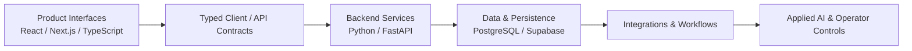
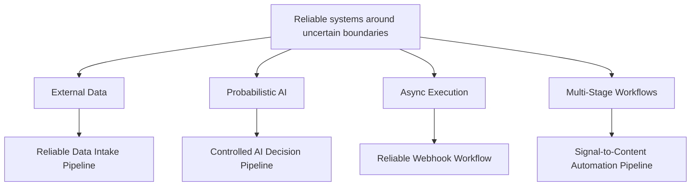
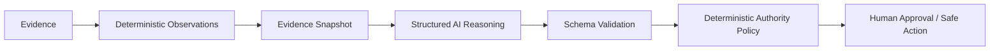
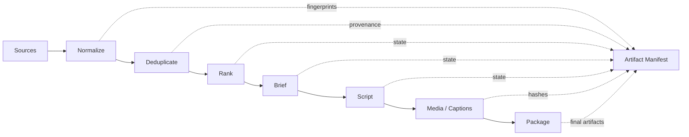
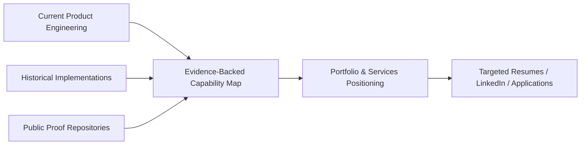

# McCallum Clarke — Engineering Portfolio

## Full-Stack & Applied AI Engineer

Product Systems • APIs • Data Pipelines • Integrations • Intelligent Automation

I build complete product systems across frontend, backend, typed contracts, data, integrations, workflow state, persistence, operational tooling, and applied AI.

My work includes authenticated SaaS applications, customer and operator interfaces, backend services, multi-tenant data systems, external integrations, background workflows, evidence-grounded AI, human approval systems, analytics, reporting, and reliability controls.

My strongest technical differentiation is in end-to-end product ownership combined with deep backend, data/workflow reliability, integrations, automation, and controlled applied AI engineering.

---

## End-to-end product engineering

I work across the full product boundary rather than treating frontend, backend, data, and AI as disconnected disciplines.

This includes:

- authenticated customer-facing SaaS experiences
- operator and internal-tool interfaces
- complex stateful workflow UIs
- typed frontend/backend integration
- REST APIs and service implementation
- PostgreSQL/Supabase persistence
- tenant-scoped authorization and row-level security
- background jobs and workflow-state modeling
- OAuth and external-provider integrations
- AI-assisted decision and review interfaces
- analytics, reporting, and operational controls
- loading, error, retry, recovery, and approval UX
- responsive product and marketing interfaces

The result is product engineering that can span a feature from interface and workflow design through API boundaries, data, integrations, AI behavior, persistence, and operational control.

---

## Engineering thesis

### Reliability around uncertain boundaries

A recurring engineering problem across my work is making systems reliable where uncertainty enters.

External data may be malformed, incomplete, duplicated, or inconsistent.

Third-party APIs can fail, retry, rate-limit, or return unexpected state.

Asynchronous work can repeat, stall, or terminate mid-execution.

AI outputs are probabilistic and should not automatically own authority.

Long-running workflows need provenance, resumability, explicit failure state, and controlled recovery.

I use typed contracts, deterministic rules, idempotency, provenance, explicit state, integrity checks, review boundaries, and recovery paths to make those systems inspectable and controllable.

The four public repositories below are standalone demonstrations of those engineering patterns.

They are not the limit of my capability. Broader full-stack, SaaS, frontend, backend, data, integration, AI, and product-system capability is also backed by current and historical product engineering work whose source repositories are not all public.

---

## Public engineering proofs

1. [**Reliable Data Intake Pipeline**](https://github.com/vantablade-ai/reliable-data-intake-pipeline)

A reliability-focused ingestion service that validates, normalizes, conservatively deduplicates, and routes heterogeneous provider data into canonical application records.

Provider-specific adapters feed typed models and deterministic decision logic, with idempotency semantics, transactional persistence, provenance, conflict handling, and observable failure states.

### Demonstrates

- FastAPI API boundaries
- provider-adapter architecture
- typed canonical data models
- Pydantic validation
- data normalization and canonicalization
- conservative deduplication
- deterministic record fingerprints
- idempotent request handling
- source and entity conflict detection
- "ACCEPTED" / "REVIEW_REQUIRED" / "REJECTED" routing
- transactional SQLite persistence
- provenance and auditability
- controlled API errors
- offline automated tests
- deterministic failure-path testing

### Engineering boundary

The proof uses synthetic providers and local SQLite persistence so the data-reliability behavior remains easy to inspect and reproduce.

It does not claim production-scale throughput or replace separate PostgreSQL/Supabase product experience.

### Commercial relevance

Useful patterns for:

- provider integrations
- ingestion APIs
- enrichment pipelines
- ETL-style workflows
- customer or lead-data intake
- canonical data modeling
- deduplication
- review queues
- unreliable external-data handling

---

2. [**Controlled AI Decision Pipeline**](https://github.com/vantablade-ai/controlled-ai-decision-pipeline)

An applied-AI system that turns evidence into structured AI-assisted decisions while keeping final authority in deterministic policy and human review.

The architecture separates evidence, deterministic observations, model reasoning, confidence, evidence quality, policy, authority, and approval state.

### Demonstrates

- typed AI boundaries
- schema-constrained model outputs
- evidence-grounded reasoning
- canonical evidence snapshots
- provenance hashes
- evidence-quality modeling
- confidence modeling
- deterministic policy around probabilistic reasoning
- bounded model authority
- human approval gates
- safe-action allowlists
- audit persistence
- provider abstraction
- optional OpenAI integration
- deterministic offline execution
- safe handling of invalid provider output
- explicit missing/conflicting evidence
- non-actionable failure states

### Engineering boundary

The model can reason and recommend, but it does not grant itself operational authority.

High model confidence cannot compensate for poor evidence, and weak or conflicting evidence cannot silently become an automatic action.

### Commercial relevance

Useful patterns for:

- AI-assisted product features
- decision-support systems
- operator copilots
- controlled AI automation
- evidence-backed analysis
- review workflows
- human-in-the-loop systems
- AI features requiring explicit authority boundaries

---

3. [**Reliable Webhook Workflow**](https://github.com/vantablade-ai/reliable-webhook-workflow)

A durable webhook-processing system that accepts external events quickly and processes them through retryable background execution.

Signed intake leads to persisted events and jobs, atomic worker claims, leases, retry/backoff behavior, stale-worker recovery, dead-letter handling, and explicit execution history.

### Demonstrates

- FastAPI webhook boundaries
- raw-body HMAC-SHA256 verification
- constant-time signature comparison
- duplicate-safe event intake
- provider-event identity
- payload fingerprinting
- duplicate/conflict semantics
- transactional event/job creation
- background jobs
- atomic worker claims
- retryable vs terminal failure classification
- exponential backoff
- jitter
- worker leases
- stale-worker recovery
- dead-letter handling
- job-attempt audit history
- deterministic clock/jitter testing
- recoverable at-least-once execution

### Engineering boundary

The proof does not claim distributed exactly-once side effects.

If a worker dies after an external side effect succeeds but before local completion is committed, the operation may be attempted again. Downstream systems still require their own idempotency where that boundary matters.

### Commercial relevance

Useful patterns for:

- SaaS integrations
- payment/event processing
- webhook consumers
- background workers
- retryable external API jobs
- event-driven workflows
- integration hardening
- failure recovery

---

4. [**Signal-to-Content Automation Pipeline**](https://github.com/vantablade-ai/signal-to-content-automation-pipeline)

A resumable multi-stage automation pipeline that transforms heterogeneous source material into structured, traceable artifacts.

Source adapters, normalization, filtering, deduplication, AI-assisted stages, deterministic ranking, media generation, and packaging are coordinated through explicit dependencies and cache-aware execution.

### Demonstrates

- source-adapter architecture
- canonical normalization
- deterministic filtering
- exact-reference/content deduplication
- structured AI-assisted classification
- deterministic weighted ranking
- provider abstraction
- typed brief and script artifacts
- explicit stage dependency graphs
- stage fingerprints
- SHA-256 artifact provenance
- cache validation
- dependency-aware invalidation
- resumability
- failure isolation
- stale-descendant invalidation
- artifact integrity verification
- deterministic synthetic WAV generation
- deterministic SRT caption generation
- optional FFmpeg media rendering
- local artifact packaging
- deterministic offline execution

### Engineering boundary

Publishing, uploading, and social-media posting are intentionally outside this proof.

The focus is the reliability of a multi-stage artifact-producing workflow: preserving lineage, avoiding unnecessary recomputation, isolating failures, and resuming safely.

### Commercial relevance

Useful patterns for:

- research pipelines
- document/report generation
- media-processing workflows
- batch automation
- AI-assisted operations
- artifact-producing pipelines
- resumable internal automation
- workflow orchestration

---

## Public proof capability matrix

"✓" means the behavior is directly demonstrated by that repository.

| Capability | Data Intake | AI Decision | Webhook Workflow | Automation Pipeline |
| --- | --- | --- | --- | --- |
| Typed contracts | ✓ | ✓ | ✓ | ✓ |
| API boundary | ✓ | ✓ | ✓ | — |
| Adapter/provider abstraction | ✓ | ✓ | ✓ | ✓ |
| Canonical normalization | ✓ | — | — | ✓ |
| Duplicate/idempotency handling | ✓ | — | ✓ | ✓ |
| Explicit conflict/failure handling | ✓ | ✓ | ✓ | ✓ |
| Provenance / auditability | ✓ | ✓ | ✓ | ✓ |
| Structured AI output | — | ✓ | — | ✓ |
| Deterministic policy | ✓ | ✓ | ✓ | ✓ |
| Human approval boundary | — | ✓ | — | — |
| Background execution | — | — | ✓ | — |
| Retry / recovery | — | — | ✓ | ✓ |
| Artifact or payload hashing | ✓ | ✓ | ✓ | ✓ |
| Dependency-aware caching | — | — | — | ✓ |
| Resumability | — | — | ✓ | ✓ |
| Integrity verification | ✓ | ✓ | ✓ | ✓ |
| Offline deterministic testing | ✓ | ✓ | ✓ | ✓ |
| Media processing | — | — | — | ✓ |

---

## Broader engineering capability

The public repositories are evidence anchors, not a complete capability inventory.

Broader capability is backed by additional current and historical product engineering work, even where the underlying source is not publicly inspectable.

### Full-stack product systems

- end-to-end product/system ownership
- React, Next.js, and TypeScript application engineering
- typed frontend/backend integration
- authenticated SaaS applications
- customer workspaces
- operator and internal-tool interfaces
- complex stateful workflow UIs
- review and approval interfaces
- human-in-the-loop AI interfaces
- async/loading/error/retry/recovery UX
- component, URL, session, and persistence-oriented frontend state
- product analytics instrumentation
- responsive application implementation
- accessibility fundamentals
- frontend design-system implementation
- product and marketing frontend engineering

Frontend engineering is a core part of my full-stack product capability, while advanced browser/platform specialization is a separate discipline I do not claim.

### Backend & APIs

- Python backend engineering
- FastAPI
- REST APIs
- Pydantic and typed contracts
- modular service architecture
- service and workflow decomposition
- authenticated API boundaries
- structured error handling
- job lifecycle modeling
- background workers
- operational APIs
- reporting and document workflows
- backend and API testing
- failure-path and edge-case testing

### Applied AI

- OpenAI API integration
- prompt and system-instruction design
- structured/schema-constrained LLM outputs
- evidence-grounded AI decision support
- deterministic + LLM hybrid systems
- AI provenance
- confidence and evidence-quality modeling
- model authority boundaries
- human approval gating
- personalization guardrails
- operator-facing AI reasoning interfaces
- evidence/conflict presentation
- advisory and approval workflows

### Data & reliability

- ingestion pipelines
- provider adapters
- canonicalization and normalization
- deterministic validation
- review/rejection routing
- deduplication
- entity matching
- idempotent processing
- ambiguity/conflict handling
- deterministic record fingerprinting
- audit provenance
- PostgreSQL
- Supabase
- SQLite
- SQL migrations
- schema evolution
- relational constraints and indexes
- repository-pattern persistence
- structured JSON workflows
- CSV export generation
- operational data modeling

### Integrations & SaaS systems

- OAuth 2.0
- OAuth state validation
- token refresh and revocation
- encrypted credential persistence
- Gmail API integration
- Smartlead integration
- HIBP integration
- DeHashed integration
- external HTTP APIs
- webhook workflows
- Supabase Auth
- JWT-authenticated APIs
- PostgreSQL row-level security
- tenant-scoped authorization
- multi-tenant SaaS architecture
- SaaS onboarding and provisioning
- entitlements and trial lifecycle logic
- incident/case workflows
- storage and reporting integrations

### Automation & operational systems

- background and scheduled workflows
- state-machine and lifecycle modeling
- retry/recovery patterns
- campaign and revenue-operations workflows
- product/funnel analytics
- internal operations tooling
- review queues
- workflow controls
- report/PDF generation
- document automation
- CSV exports
- media automation
- FFmpeg rendering
- Whisper transcription and subtitle generation
- artifact-producing workflows

---

## Product-system examples

Broader product work includes systems such as:

- authenticated multi-tenant SaaS workspaces
- customer onboarding and provisioning
- employee/entity management workflows
- incident and case-management systems
- reporting interfaces
- operator command centers
- campaign and prospect-management systems
- personalization review and approval flows
- analytics dashboards
- import dry-run / preview / commit workflows
- conversation and message-memory systems
- deliverability and operational-health interfaces
- AI backlog and reasoning-audit interfaces
- human approval and outcome-tracking systems

These systems span UI state, typed API clients, backend services, authorization, persistence, workflow logic, integrations, AI behavior, and operational controls.

---

## Engineering principles

I tend to design systems around a few recurring principles:

1. Own the product boundary end to end when the problem requires it.
2. Define explicit contracts rather than relying on implicit behavior.
3. Keep frontend state separate from backend-authoritative state.
4. Use deterministic logic where deterministic logic is sufficient.
5. Do not give probabilistic AI unrestricted authority.
6. Make repeatable operations idempotent and recoverable.
7. Preserve provenance across transformations and decisions.
8. Model important workflow and failure states explicitly.
9. Surface ambiguity instead of forcing unsafe certainty.
10. Design operator controls around real authority boundaries.
11. Validate data and artifact integrity before reuse.
12. Use dependency-aware invalidation instead of recomputing everything.

---

## Evidence discipline

Claims in this portfolio are tied to implemented current, historical, or public repository evidence.

Historical implementation remains valid engineering evidence and is described in its proper context. Public proof repositories provide externally inspectable demonstrations of selected engineering patterns; they do not define or limit the broader capability map.

I distinguish between implemented capability and specialist depth.

I do not position myself as a specialist in areas where the engineering evidence does not support that claim, including:

- ML model training and fine-tuning
- data science
- DevOps/SRE or cloud architecture
- distributed-systems specialization
- penetration testing
- cybersecurity specialization
- advanced browser/rendering-engine engineering
- advanced frontend-performance specialization
- enterprise-scale frontend-platform architecture
- large-scale frontend-testing infrastructure
- WebGL/graphics specialization
- conversational voice-agent engineering

Some public proofs intentionally use SQLite, synthetic data, deterministic providers, or mock adapters so the relevant engineering behavior remains reproducible and independently testable.

The public proof repositories are not presented as production deployments.

---

## Work

Available for engineering work involving:

- full-stack product engineering
- end-to-end feature implementation
- backend and API engineering
- applied-AI product systems
- authenticated SaaS applications
- operator dashboards and internal tools
- data and integration pipelines
- API/provider integrations
- workflow automation
- reliability hardening
- AI-assisted workflow systems
- technical subcontracting for agencies and product teams

I can work inside an existing codebase or own a bounded system across frontend, backend, data, integrations, AI, and operational workflow boundaries.

Contact me through the public methods on my [**GitHub profile**](https://github.com/vantablade-ai).
