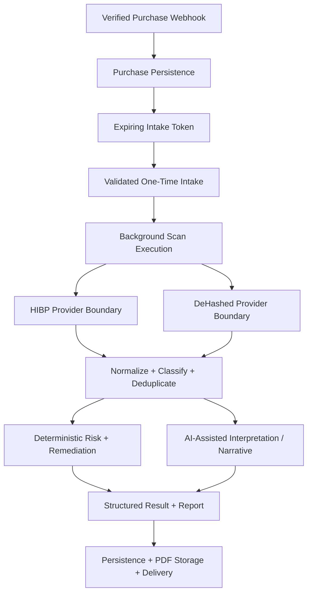

# VantaBlade DeepScan

## 1. System overview

VantaBlade DeepScan is a multi-source identity-intelligence and applied-AI workflow that transforms heterogeneous exposure data into structured risk analysis, remediation guidance, persisted reports, and customer delivery.

It combines provider orchestration, identity normalization, evidence classification, deterministic scoring and remediation, AI-assisted interpretation/reporting paths, paid intake, background execution, storage, and delivery. The system is a point-in-time analysis product, not an ongoing monitoring service.

## 2. Product problem

Exposure intelligence arrives from providers with different schemas, identifiers, coverage, failure modes, and evidence semantics. A paid product must turn those inputs into one bounded customer workflow without treating every provider result as equivalent or allowing a generative model to become the sole authority over risk.

DeepScan must also coordinate the commercial path around the analysis: verify purchase intake, separate buyer/delivery identity from scanned identifiers, issue expiring access, consume that access once, run longer work asynchronously, persist results, render a document, and deliver the artifact.

## 3. Engineering scope

### Data and provider orchestration

- Have I Been Pwned integration for public breach data
- DeHashed integration for indexed exposure intelligence
- email, username, phone, IP, and domain input shapes
- request and identifier normalization
- provider-specific fetch and classification boundaries
- typed, structured findings with matched and secondary identifiers
- deduplication and aggregation across public and private-provider results
- explicit `ok`, `partial`, `degraded`, and `failed` result vocabulary

### Analysis and applied AI

- deterministic impact classification, risk scoring, top-driver selection, and score bounds
- deterministic recommendation rules tied to observed data types and evidence
- OpenAI integration for AI-assisted analysis and report/narrative work where configured
- structured response models for risk, evidence, recommendations, confidence notes, and checked/not-found state
- evidence retained separately from interpretation
- model output used inside application-controlled workflows rather than as authorization

### Commerce and post-purchase intake

- Gumroad webhook intake and verification boundary
- JSON and form-encoded payload handling
- purchase identity and purchase record persistence
- distinct buyer, scanned, and delivery identity roles
- generated high-entropy intake tokens
- expiring tokenized links
- token validation and one-time consumption state
- post-purchase intake that can queue background scan execution

### Reports and delivery

- structured scan results and persisted report data
- Markdown/report assembly
- PDF rendering
- Supabase-backed storage and report references
- email delivery
- latest-report retrieval from persisted records

## 4. High-level architecture

The purchase/intake path governs access to the workflow. Provider adapters gather evidence. Application code normalizes and classifies it, records coverage or provider degradation, computes important deterministic outputs, and invokes AI only within a bounded report/interpretation role. Delivery is downstream of a persisted result and generated artifact.

## 5. Important system boundaries

### Purchase identity, scan target, and delivery identity

The buyer email is commercial intake data. The scanned identifiers define the analysis target. The delivery address determines where the result is sent. These concepts can overlap, but the system does not assume they are always identical.

### Provider evidence and application truth

HIBP and DeHashed have different schemas and source semantics. Their responses are mapped to typed findings before scoring or reporting. Duplicate findings are reconciled, and provider failure can downgrade result status instead of being presented as a complete negative result.

### Deterministic and probabilistic behavior

The inspected current analysis path implements risk scoring and recommendation selection in deterministic Python. OpenAI integration supports analysis and narrative/report behavior elsewhere in the product workflow. This case study therefore does not claim that an LLM autonomously determines all risk, remediation, or system authority.

### Request acknowledgement and long-running work

Token consumption can schedule the scan as background work so intake does not need to hold an HTTP request open for provider calls, analysis, rendering, persistence, and delivery.

## 6. Key engineering capabilities demonstrated

### Heterogeneous data fusion

DeepScan normalizes several identifier types, queries provider-specific interfaces, and transforms external payloads into shared finding models. It records source, date, impact, confirmed data types, matching identifiers, and source-specific context. Deduplication prevents the same underlying breach evidence from being represented as unrelated findings merely because multiple provider paths observed it.

### Evidence-aware result state

The result contract distinguishes successful, partial, degraded, and failed states and carries confidence notes. Explicit checked/not-found structures avoid silently equating “provider did not return a record” with universal absence.

### Controlled analysis

Deterministic code calculates risk score bands from classified evidence, caps values, records top drivers, and creates remediation steps based on observed data classes. AI-assisted paths can explain, interpret, or format that evidence without taking over webhook verification, token validity, persistence authority, or delivery state.

### Tokenized paid workflow

The commerce path verifies webhook requests, parses provider payload formats, persists purchases, issues tokenized intake links with expiration, validates token state, records consumption, and prevents reuse of a consumed token. This is a reusable pattern for paid workflows where the purchased action requires additional customer input.

### Document workflow

The system assembles structured findings and recommendations into report content, renders a PDF, stores the artifact, persists the result/reference, and initiates email delivery. Failures at provider, persistence, rendering, storage, and email boundaries remain distinct operational concerns.

## 7. Reliability, authority, and privacy considerations

- Provider calls are isolated so one source can fail without falsely converting unavailable coverage into a clean result.
- Result status and confidence notes preserve partial/degraded execution information.
- Findings are typed and normalized before scoring, recommendations, or presentation.
- Important risk and remediation behavior has deterministic application logic; a language model is not the sole system authority.
- Intake links expire and carry consumption state.
- Purchase data, scanned identifiers, provider evidence, and delivery addresses are different data roles and should be handled accordingly.
- Results and report references are persisted. This case study does not make a transient-processing or no-storage guarantee.
- Secrets, raw customer data, provider credentials, and deployment configuration are intentionally excluded.

## 8. Transferable engineering patterns

- assessment and diagnostic products
- enrichment and data-fusion pipelines
- multi-provider research/intelligence systems
- AI-assisted report and document products
- deterministic analysis augmented by controlled narrative generation
- paid digital workflows
- verified webhook intake
- tokenized post-purchase forms or onboarding
- background analysis and delivery workflows
- persisted artifacts, report references, and customer delivery

These patterns apply outside security to due-diligence tools, research products, compliance assessments, lead enrichment, document generation, and other paid data workflows.

## 9. Related public proof repositories

- [Reliable Data Intake Pipeline](https://github.com/vantablade-ai/reliable-data-intake-pipeline) isolates provider adapters, normalization, canonical records, deduplication, conflicts, and provenance.
- [Controlled AI Decision Pipeline](https://github.com/vantablade-ai/controlled-ai-decision-pipeline) isolates schema-constrained reasoning, evidence quality, deterministic authority, and human review.
- [Reliable Webhook Workflow](https://github.com/vantablade-ai/reliable-webhook-workflow) isolates signature validation, duplicate-safe intake, durable jobs, retries, recovery, and at-least-once boundaries.

## 10. Evidence and claim boundaries

This case study describes implemented VantaBlade product behavior. It does not imply that the private product source is publicly inspectable.

DeepScan is accurately described as point-in-time analysis over known breach datasets and indexed identity-exposure intelligence. It is not described as:

- active or ongoing dark-web monitoring
- live marketplace surveillance
- breach prevention
- EDR, SIEM, penetration testing, or active-compromise detection
- autonomous remediation

No performance, scale, customer, revenue, accuracy, certification, or coverage metrics are claimed. The evidence supports full-stack workflow, integration, data, applied-AI, reporting, and delivery engineering—not cybersecurity-specialist positioning.

[← Product-system index](README.md) · [Engineering portfolio](../README.md)
