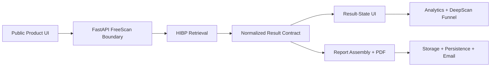

# VantaBlade FreeScan

## 1. System overview

VantaBlade FreeScan is a lightweight public data product that turns an anonymous user action into external-data retrieval, normalized risk results, generated reporting, delivery, and downstream product-funnel events.

It is the smallest flagship system in this portfolio. Its value as engineering evidence comes from connecting a public user journey to a real provider, stable backend contract, result-state UI, report workflow, persistence, analytics, and a commercial transition into DeepScan.

## 2. Product problem

A public exposure check must make an external provider useful inside a low-friction product flow. That means validating input, handling provider results, translating heterogeneous breach fields into a concise response, presenting clear result states, optionally generating and delivering a report, and preserving the funnel context needed for the next product action.

The engineering problem is not only “call an API.” It is to connect anonymous intake, external data, transformation, presentation, document generation, storage, delivery, and analytics without pretending those boundaries are infallible or privacy-neutral.

## 3. Engineering scope

- public Next.js/React product flow
- public FastAPI scan and report endpoints
- request/input validation
- Have I Been Pwned integration
- provider-response transformation
- normalized result contract for score, breach count, password exposure, risks, recommendations, and recent breach context
- explicit results, clear, error, and downstream call-to-action states
- frontend/backend integration and funnel-context propagation
- AI-assisted report content generation where configured, plus PDF rendering
- Supabase-backed artifact storage and persisted report records
- email delivery with distinct scanned and delivery address fields
- first-party product analytics
- FreeScan → DeepScan commercial flow

## 4. High-level architecture

The immediate scan path retrieves HIBP data and maps it into a product response. The report path repeats the authoritative lookup, derives report facts, renders and stores a PDF, records report metadata, and sends delivery email. The frontend carries result and attribution context into subsequent product actions.

## 5. Important system boundaries

### Public intake versus authenticated SaaS

FreeScan is an anonymous public product flow. It does not inherit the company, membership, RLS, entitlement, and incident/case model used by Identity Risk Ops.

### Scanned identity versus delivery identity

The address being checked and the address receiving a report are represented separately. The system can default one from the other, but it does not erase the conceptual distinction.

### Provider result versus product result

HIBP payloads are external evidence. The backend transforms them into a bounded product contract with selected breach facts, score/presentation fields, and recommended next action. The frontend consumes that contract rather than depending directly on provider response shape.

### Free product versus paid workflow

FreeScan owns the public assessment and report flow. DeepScan is a separate point-in-time paid analysis with broader identifiers, provider fusion, tokenized intake, and a different report workflow.

## 6. Key engineering capabilities demonstrated

### API-backed public product

The product connects a public interface to a FastAPI endpoint, performs server-side input checks, retrieves external data, and returns a normalized response suitable for stable frontend states.

### External-data transformation

Provider breach records are reduced to the information the product needs: exposure count, password indicator, latest breach context, presentation score/state, top risks, and next-step guidance. This is a small but clear example of keeping provider schemas behind an application contract.

### Report and delivery workflow

The report endpoint distinguishes scanned and delivery addresses, retrieves source data, assembles report facts, generates report content, renders PDF bytes, stores the artifact, persists report metadata, and invokes email delivery.

### Product funnel integration

The frontend preserves product and attribution context across FreeScan results and the DeepScan call to action. First-party event instrumentation connects acquisition, assessment, and later signup/onboarding stages to the broader backend analytics model.

## 7. Reliability, authority, and privacy considerations

- The backend owns provider retrieval and result transformation; the UI does not infer provider truth independently.
- Scan and report paths are separate operations with separate failure boundaries.
- Report rendering, storage, persistence, and email delivery can fail independently and should not be described as one guaranteed action.
- The current backend writes FreeScan scan/funnel records and report records and stores generated report artifacts. Scanned identifiers can therefore participate in persisted workflows.
- This case study deliberately does not claim purely in-memory processing, immediate deletion, or that scanned identifiers are never persisted.
- No raw credentials, customer records, or sensitive deployment details are exposed here.

## 8. Transferable engineering patterns

- lead-generation tools
- public assessment products
- calculators and qualification workflows
- external-data lookup products
- freemium product funnels
- result-state interfaces
- generated-report products
- document storage and delivery workflows
- anonymous-to-paid conversion flows
- first-party product analytics

## 9. Related public proof repositories

- [Reliable Data Intake Pipeline](https://github.com/vantablade-ai/reliable-data-intake-pipeline) isolates external-data validation, normalization, canonicalization, and failure routing.
- [Reliable Webhook Workflow](https://github.com/vantablade-ai/reliable-webhook-workflow) isolates durable external-event processing, idempotency, background work, and recovery patterns relevant to downstream paid workflows.

FreeScan is intentionally not mapped to the Controlled AI proof as a primary relationship: its strongest evidence is public API integration, external-data transformation, reporting, and funnel workflow.

## 10. Evidence and claim boundaries

This case study describes implemented frontend and backend behavior without claiming that the underlying product source is public.

It does not claim:

- that FreeScan provides complete identity intelligence
- active dark-web monitoring or live marketplace surveillance
- breach prevention, compromise detection, EDR, SIEM, or penetration testing
- guaranteed report delivery or provider coverage
- purely in-memory processing or non-persistence of scanned identifiers
- customer, conversion, accuracy, performance, or scale metrics

The supported claim is a compact, end-to-end public data product spanning interface, API, provider integration, transformation, result states, report generation, storage, delivery, analytics, and commercial funnel integration.

[← Product-system index](README.md) · [Engineering portfolio](../README.md)
