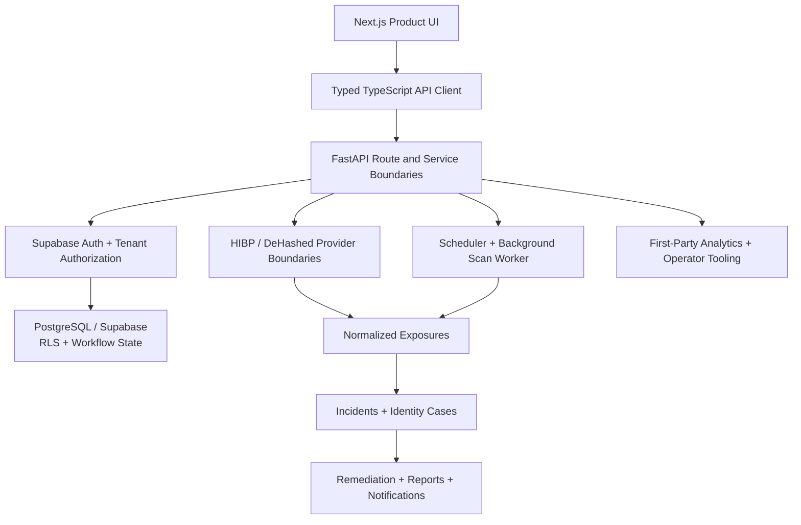

# VantaBlade Identity Risk Ops

## 1. System overview

VantaBlade Identity Risk Ops is an authenticated multi-tenant SaaS product that turns employee identity-exposure data into operational incidents, identity cases, remediation workflows, reporting, and ongoing organizational workflow state.

It is the strongest product-system evidence in this portfolio because it combines customer-facing software, typed frontend/backend integration, authorization, relational data, external providers, background work, domain workflows, reporting, analytics, and internal operator tooling within one implemented environment.

The security domain is the application context. The engineering evidence transfers to SaaS, case-management, compliance, assessment, workflow, and data-operations products.

## 2. Product problem

Raw exposure-provider results are not by themselves an operational product. A customer needs stable organization and employee state, a way to distinguish known history from newly observed findings, an actionable incident lifecycle, identity-level aggregation, remediation state, and reports that summarize what happened.

The system converts provider observations into a repeatable workflow:

```text
Employee inventory
  → exposure scan
  → normalized findings
  → net-new exposure detection
  → incidents
  → identity cases
  → remediation state
  → reporting
```

That requires more than scan execution. It requires user and tenant context, product access rules, explicit lifecycle state, reliable background execution, customer-facing state presentation, and operator visibility.

## 3. Engineering scope

### Product interface

- Next.js, React, and TypeScript customer application
- Supabase Auth session integration
- authenticated workspace and dashboard routes
- typed contracts for companies, employees, scan runs, incidents, identity cases, reports, entitlements, trials, analytics, and operational state
- loading, empty, error, refresh, retry, and scan-lifecycle UI states
- interfaces that render backend-authoritative status rather than recreating domain rules in the browser

### Backend and API

- Python and FastAPI
- versioned REST routes with Pydantic request/response contracts
- route, domain-service, provider, persistence, and worker boundaries
- authenticated customer APIs and separately controlled operational APIs
- structured lifecycle state for scans, incidents, identity cases, reports, and notifications

### SaaS data and authorization

- Supabase Auth and JWT-authenticated API access
- PostgreSQL/Supabase persistence
- companies as tenant roots and company memberships as the user/tenant association
- company-scoped employees, exposures, incidents, cases, scan runs, reports, and notification events
- PostgreSQL Row Level Security plus backend company-access checks
- server-side handling for operations that require elevated service access

### Product lifecycle

- company creation and owner membership creation
- self-serve plan selection mapped to stored entitlement state
- backend-enforced active-employee limits
- trial start/end and product-access lifecycle rules
- employee bulk onboarding, deduplication, activation, reactivation, and soft deactivation
- preserved historical workflow records when an employee is deactivated

The backend models subscription/product-access state, but B2B payment processing is not claimed as an implemented authority in this system.

## 4. High-level architecture



The user interface consumes typed API state. The FastAPI layer verifies user and company context, applies domain rules, and delegates scan, entitlement, trial, reporting, and analytics behavior. PostgreSQL/Supabase holds the durable tenant and workflow state. Background workers use a protected operational boundary for scheduled work.

## 5. Important system boundaries

### Frontend versus backend authority

The frontend renders entitlement, trial, scan, incident, case, report, and analytics state. Employee capacity, product access, tenant access, scan claiming, incident creation, and lifecycle transitions remain backend responsibilities.

### User context versus system context

Customer routes use authenticated user context and tenant-scoped data access. Background and narrowly scoped system operations require elevated credentials and separate authorization. A service credential is not exposed to the browser.

### Provider data versus domain state

HIBP and DeHashed responses enter through provider-specific boundaries. Findings are normalized before they become persisted exposures, incidents, or identity cases. Provider output is evidence; it is not itself the customer workflow model.

### Current product versus adjacent operations

Identity Risk Ops is the customer-facing product system. RAD/commercial operations is adjacent internal infrastructure with its own companies, contacts, campaigns, membership, activities, enrichment, personalization, approval, analytics, and workflow state. It supports the broader engineering story without being conflated with the customer product.

## 6. Key engineering capabilities demonstrated

### Multi-tenant full-stack SaaS

The product connects authenticated Next.js interfaces to FastAPI services through typed client contracts. Company membership establishes tenant context; tenant-scoped data is protected by API checks and PostgreSQL RLS. Customer workflows cover company setup, employee inventory, scans, incidents, cases, remediation, and reports.

### Entitlements and lifecycle rules

The backend is authoritative for employee capacity. It normalizes plan selection, counts active employees, blocks capacity violations, handles reactivation consistently, and resolves trial/product-access state. Unknown entitlement state is not treated as unlimited.

### Scan and incident workflow

Scan runs move through queued, running, succeeded, and failed states. The scan engine retrieves provider data for active employees, records provider warnings, normalizes findings, fingerprints exposures, and updates last-seen state for known records. Newly inserted exposure records can create incidents, while stable incident keys prevent the same employee/breach relationship from becoming uncontrolled duplicate state.

A first successful scan establishes persisted exposure state. Later scans compare against that state through deterministic fingerprints so existing findings and net-new records can be treated differently. This portfolio does not claim that every baseline finding is silently suppressed; the implementation creates workflow records from newly persisted exposures.

### Identity cases and remediation

Identity cases aggregate incidents by employee, calculate open and total incident counts, carry the highest observed severity, and surface contributing evidence. Marking a case remediated closes its open incidents and records remediation state; newly open incidents can return the identity workflow to an open state.

### Background operations

- scheduled scan selection
- queued work and atomic claim behavior
- controlled worker concurrency
- stale scan recovery
- provider-warning and scan-failure state
- notification-event recording with idempotency keys
- scheduled and on-demand report paths

### Reporting

Operational facts are aggregated from persisted company, employee, exposure, incident, and case state. The report workflow supports deterministic fact assembly, AI-assisted narrative where configured, Markdown/PDF rendering, Supabase-backed artifact storage, persisted report records, refreshed access links, and delivery behavior.

### Product analytics

The first-party analytics subsystem demonstrates:

- a typed, allowlisted event vocabulary
- event validation and bounded metadata
- rejection of raw IP fields in generic metadata
- production, staging, and local environment state
- production versus internal-test traffic classification
- visitor/session and campaign attribution fields
- acquisition → signup → onboarding → activation → payment lifecycle instrumentation
- backend-defined funnel aggregation and conversion calculations
- idempotent handling for authoritative backend lifecycle events
- operator views and controls for test sessions, test identities, and scoped cleanup

The analytics UI renders backend-computed conversion truth. The implementation does not claim a B2B payment authority where one is not connected.

### Internal operational tooling

The surrounding product environment includes typed frontend/backend contracts and operator workflows for companies, contacts, campaigns, campaign membership, activities, imports, enrichment, personalization, approval/review state, deliverability, analytics, and AI-assisted decision support. These interfaces demonstrate internal product engineering, not merely administrative CRUD.

## 7. Reliability, authority, and privacy considerations

- RLS and company-access checks constrain tenant-scoped operations; this is application authorization evidence, not a claim of formal enterprise security certification.
- Backend services own employee limits, product-access rules, scan claiming, and workflow transitions.
- Exposure fingerprints and stable incident keys provide deterministic identity for repeat observations.
- Queued/running conflict checks, atomic claims, and stale-job recovery reduce duplicate or abandoned scan execution.
- Provider failures can be preserved as warnings or degraded workflow state rather than silently converted into complete results.
- AI-generated summaries or narratives sit around deterministic facts and workflow state; they do not replace tenant authorization or lifecycle authority.
- Customer identifiers and provider findings are privacy-sensitive. This case study intentionally omits secrets, customer data, storage configuration, and operational details that are unnecessary to evaluate the architecture.

## 8. Transferable engineering patterns

- authenticated multi-tenant SaaS and organization workspaces
- onboarding, provisioning, entitlements, trials, and lifecycle access
- inventory-to-case workflow systems
- external-data normalization and delta detection
- background jobs, schedulers, job claims, and recovery
- customer/operator views over shared backend-authoritative state
- incident, ticket, assessment, or compliance case management
- document/report generation and artifact delivery
- first-party event ingestion and funnel analytics
- CRM, campaign, review, and internal operations tooling
- deterministic systems augmented by controlled AI narrative or decision support

## 9. Related public proof repositories

- [Reliable Data Intake Pipeline](https://github.com/vantablade-ai/reliable-data-intake-pipeline) isolates normalization, canonical data models, conservative deduplication, conflicts, provenance, and idempotent intake.
- [Reliable Webhook Workflow](https://github.com/vantablade-ai/reliable-webhook-workflow) isolates durable intake, persisted jobs, atomic claims, retries, leases, recovery, and dead-letter behavior.
- [Controlled AI Decision Pipeline](https://github.com/vantablade-ai/controlled-ai-decision-pipeline) isolates evidence snapshots, structured reasoning, deterministic policy, bounded model authority, and human approval.

These proofs demonstrate related patterns; they do not reproduce the complete Identity Risk Ops product or establish that its private source is public.

## 10. Evidence and claim boundaries

This case study is based on implemented VantaBlade frontend and backend evidence. It does not disclose or link private product source.

It does not claim:

- customer counts, revenue, throughput, uptime, or deployment scale
- formal enterprise security certification
- breach prevention, endpoint detection and response, SIEM, active-compromise detection, or automated remediation
- live crawling or surveillance of criminal marketplaces
- security-research, penetration-testing, SOC, or cybersecurity-specialist expertise
- DevOps/SRE, cloud-architecture, or distributed-systems specialization

The supported claim is end-to-end full-stack and applied-AI engineering in a security-product domain: product interfaces, typed APIs, tenant-scoped data, external integrations, operational workflows, automation, reporting, analytics, and controlled AI behavior.

[← Product-system index](README.md) · [Engineering portfolio](../README.md)
